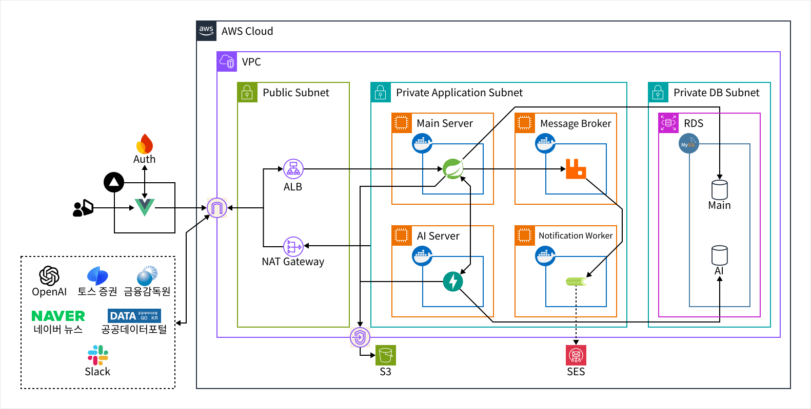

# FirstFolio-AI

FirstFolio의 AI 서버다. 금융 교과서와 뉴스를 검색해 근거를 찾고, 그 근거만으로 금융교육 퀴즈와 금융 레터를 만들어 검증한 뒤 메인 서버에 넘긴다.

청킹을 고쳐 퀴즈에 **쓸 수 있는 근거 비율을 60%에서 91%로** 올렸고, 벡터 검색 Hit@5는 88.5%에서 92.3%가 됐다. 개발 세트 지표를 모두 올린 가중치 후보는 별도 질문 26개에서 Hit@5가 84.6%에서 80.8%로 떨어져 채택하지 않았다.
서비스 전체는 [FirstFolio-BE](https://github.com/KB7-25-2/FirstFolio-BE)와 [FirstFolio-FE](https://github.com/KB7-25-2/FirstFolio-FE)에 있다.

---

## 필요한 문서 찾기

| 하려는 일 | 문서 |
| --- | --- |
| 코드를 처음 읽는다 | [온보딩 문서](./docs/onboarding/README.md) |
| 원문 등록부터 하이브리드 검색까지 확인 | [1권 RAG 검색 파이프라인](./docs/onboarding/01-rag-pipeline.md) |
| 퀴즈 생성과 검증 단계 확인 | [2권 문항 생성과 검증](./docs/onboarding/02-quiz-generation.md) |
| 테스트와 검색·문항 품질 측정 확인 | [3권 테스트와 성능 평가](./docs/onboarding/03-testing-and-evaluation.md) |
| 로컬 실행, 환경 변수, 검수 API, 배치 Dry Run | [개발 가이드](./docs/development.md) |
| Spring으로 보내는 퀴즈 API 계약 확인 | [퀴즈 배치 전달 API](./docs/api/quiz-question-batch-api.md) |
| 퀴즈 JSON과 BE 테이블 대응 확인 | [ERD 매핑](./docs/erd/ai-quiz-question-mapping.md) |

---

## 시스템 아키텍처



이 레포는 그림의 **AI Server** 하나다.

- 프론트엔드는 AI 서버를 직접 부르지 않는다. 요청은 모두 Spring 메인 서버를 거친다.
- 메인 서버와 AI 서버는 내부 API로 주고받는다. AI는 생성 대상 단원을 받아 오고, 검증을 통과한 퀴즈와 금융 레터를 보낸다. 서버 간 요청은 `X-Internal-Token`으로 확인한다.
- RDS 안에서 AI는 **AI DB**만 쓴다. 문서와 청크를 저장하고, 메인 DB는 건드리지 않는다.
- 원문 TXT와 FAISS 인덱스 백업은 S3에 둔다.
- 밖으로 나가는 호출은 OpenAI(생성·임베딩)와 네이버 뉴스 검색 API다. 그림의 토스증권, 금융감독원, 공공데이터포털, Slack은 메인 서버 쪽 연동이다.

사용자 인증, 학습 진도와 채점, 포인트, 포트폴리오 거래, 콘텐츠의 최종 저장과 게시는 메인 서버가 맡는다.

---

## 쉽게 말하면

교과서를 잘게 나눠 두고, 질문이 오면 키워드와 의미 두 방식으로 근거를 찾는다. 찾은 근거의 문장만 인용할 수 있게 묶어서 퀴즈를 만들고, 네 단계로 걸러서 통과한 것만 보낸다.

### 문서가 검색 가능해지기까지

```text
TXT 원문 등록
→ S3에 버전과 함께 원문 저장
→ 문서 유형별 청커 선택 (교과서 / 뉴스 / 일반 문단)
→ MySQL에 문서·청크 저장
→ Kiwi 형태소 분석 + BM25 색인
→ OpenAI 임베딩 + FAISS 색인
```

교과서는 번호형 제목(장·절)을 청크마다 물려주고, 제목만 남은 짧은 조각은 다음 본문과 합친다. 퀴즈 근거가 제목 조각으로 잘리던 문제를 이 병합으로 고쳤다. 청크는 1,126개에서 831개로 줄었다.

MySQL 청크, BM25 결과, FAISS 결과는 같은 `chunk_key`로 이어진다. 서버를 시작할 때 MySQL 청크 수와 FAISS 벡터 수를 비교해 다르면 경고를 남기고, 품질 측정에서는 아예 멈춘다.

### 근거를 찾는 방법

BM25(키워드)와 FAISS(의미)에서 각각 후보 20개를 받아 순위로 합친다(RRF, k=60). 가중치는 BM25 0.7, FAISS 0.3이고 최종 5개를 근거로 쓴다.

점수가 아니라 순위로 합치는 이유는 두 검색의 점수 단위가 달라서다. 금융 교과서는 용어가 정확히 일치하는 경우가 많아 BM25 비중을 높게 뒀다.

### 퀴즈를 만들고 거르는 방법

```text
상위 5개 근거 청크 검색
→ 구조화 생성 (근거 청크의 문장만 고를 수 있는 응답 스키마)
→ 1단 코드 규칙: 형식, 선택지 중복, 영어 혼용, 인용 문장, 집계 주장
→ 2단 의미 중복: 이미 만든 문제와 겹치는지
→ 2.5단 금융 수치: 숫자·금리·금액이 근거에 있는지
→ 3단 LLM 근거 검증: 정답이 근거로 뒷받침되는지
→ 출처 조립, 선택지 섞기
```

응답 스키마는 검색이 끝난 뒤 실행 중에 만든다. 그 청크의 `chunk_key`와 문장을 한 쌍으로만 고를 수 있어서, 근거에 없는 문장이나 다른 청크의 문장을 인용할 수 없다. 프롬프트로 부탁하는 대신 형식으로 막은 것이다.

| 유형 | 단원 | 선택지 |
| --- | --- | --- |
| `TRUE_FALSE` | 소단원 | `O`, `X` |
| `SINGLE_CHOICE` | 소단원 | `1`~`4` |
| `SCENARIO` | 대단원 | `1`~`4`, 상황 설명 필수 |

---

## 어떻게 도는가

| 구분 | 사용 |
| --- | --- |
| 언어·프레임워크 | Python 3.12, FastAPI |
| 생성·임베딩 | OpenAI `gpt-4o-mini`, `text-embedding-3-small` |
| 검색 | Kiwi + BM25, FAISS(`IndexFlatIP`) |
| 저장 | MySQL 8.0(AI DB), Amazon S3 |
| 실행·검증 | Docker Compose, Pytest, Ruff, GitHub Actions |

### 패키지

```text
app/
├── api/              # FastAPI 라우터
├── application/      # 등록·청킹·검색·생성·검증 서비스
├── core/             # 환경 설정
├── domain/           # 문서·청크·검색·퀴즈 모델
├── infrastructure/   # OpenAI·MySQL·S3·BM25·FAISS·네이버 뉴스 구현
└── *.py              # 배치와 CLI 진입점
db/init/              # AI DB DDL
tests/                # 단위·통합 테스트
```

외부 API와 저장소 구현은 `infrastructure`에만 두고, `application`은 그 인터페이스만 쓴다.

---

## 로컬에서 실행하기

```bash
cp .env.example .env
docker compose up -d --build
```

`.env`에 OpenAI 키와 MySQL 접속 정보를 넣는다. 실행되면 `GET http://localhost:8000/health`로 확인한다. 환경 변수 목록, 로컬 퀴즈 검수 API, 배치 Dry Run은 [개발 가이드](./docs/development.md)에 있다.

### 변경 사항 검증

```bash
docker compose exec -T ai-api python -m pytest
docker compose exec -T ai-api ruff check .
docker compose exec -T ai-api ruff format --check .
```

테스트 함수는 474개이고, 매개변수 조합까지 세면 523개가 실행된다(516 통과, 외부 연동 7개 건너뜀). OpenAI, S3, MySQL은 테스트 대역으로 바꿔서 돌리므로 비용이 들지 않는다. 실제 MySQL 통합 테스트는 `RUN_MYSQL_INTEGRATION_TESTS=true`일 때만 돈다.

GitHub Actions는 PR과 `main`, `dev` 푸시마다 Ruff, Pytest, Docker 이미지 빌드를 실행한다.

---

## 배포

배포 워크플로는 `main`에 머지되면 ARM 이미지를 만들어 ECR에 올리고, SSM으로 EC2에서 `docker compose pull`과 `up -d`를 실행하도록 만들어 두었다. AWS 인증은 OIDC로 받아 키를 저장하지 않는다.

네이버 뉴스 수집 워크플로는 매일 09:00(KST)에 돌아 메인 서버로 보내도록 만들어 두었다. 지금은 두 워크플로 모두 꺼 두었다.

---

## 측정에서 무엇을 보았나

검색 평가는 질문 26개와 정답 청크로 Hit@5와 MRR을 쟀다. 원본 결과는 Git 밖(`data/local/evaluation/`)에 있고, 표와 해석은 [3권](./docs/onboarding/03-testing-and-evaluation.md)에 있다.

- **청크 병합**: 전체 청크의 27.8%가 제목·목차 같은 짧은 조각이었다. 병합 뒤 7개 주제에서 쓸 수 있는 근거가 21/35(60%)에서 32/35(91%)가 됐고, FAISS Hit@5는 88.5%에서 92.3%가 됐다.
- **가중치 후보를 버린 일**: BM25 0.8 / FAISS 0.2(RRF k=10) 후보는 일상어로 바꾼 개발 세트에서 Hit@5와 MRR을 모두 올렸다. 별도 질문 26개로 다시 재 보니 MRR은 올랐지만 Hit@5가 84.6%에서 80.8%로 떨어져, 정답을 하나 더 놓쳤다. 과적합으로 보고 기존 설정을 유지했다.
- **벡터 색인 누락**: 기준선을 다시 잴 때 MySQL 청크는 1,126개인데 FAISS 벡터는 1,018개였다. 문서 하나(108개 청크)가 벡터 색인에서 빠져 있어 재색인으로 맞춘 뒤 측정했다. 같은 누락을 놓치지 않도록 MySQL 청크 수와 FAISS 벡터 수를 비교하는 검사를 넣었다.
- **자동 통과율과 실제 품질**: 같은 주제 10개로 만든 퀴즈는 자동 검증을 90% 통과했지만, 사람이 읽어 보니 큰 수정 없이 쓸 수 있는 것은 10개 중 2~3개였다. 이때 나온 문제(복수 정답, 영어 혼용, 인용이 주장을 뒷받침하지 못함)를 1단 코드 규칙에 추가했다.

---

## 알려진 한계

- 평가 질문이 26개라 질문 하나가 약 4%다. 문항 품질 평가도 10문항을 한 사람이 한 번 본 진단값이다.
- 자동 검증을 통과해도 바로 쓸 수 있는 문항은 일부다. 그래서 메인 서버에서 사람이 검수한 뒤에 게시한다.
- BM25 객체는 서버 메모리에만 있어 시작할 때마다 다시 만든다. 지금 규모(청크 831개)에서는 몇 초면 끝난다.
- 뉴스는 기사 전문이 아니라 출처가 붙은 요약만 다룬다. 뉴스 본문 수집과 보관 정책은 정해지지 않았다.
